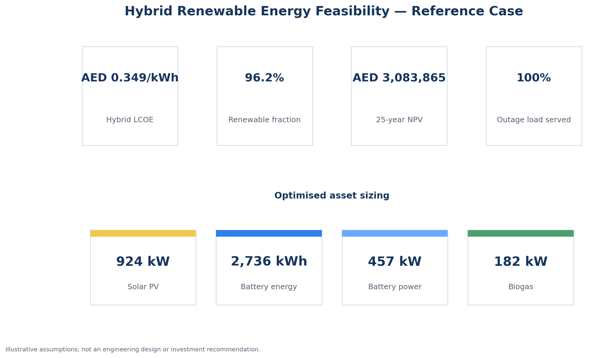
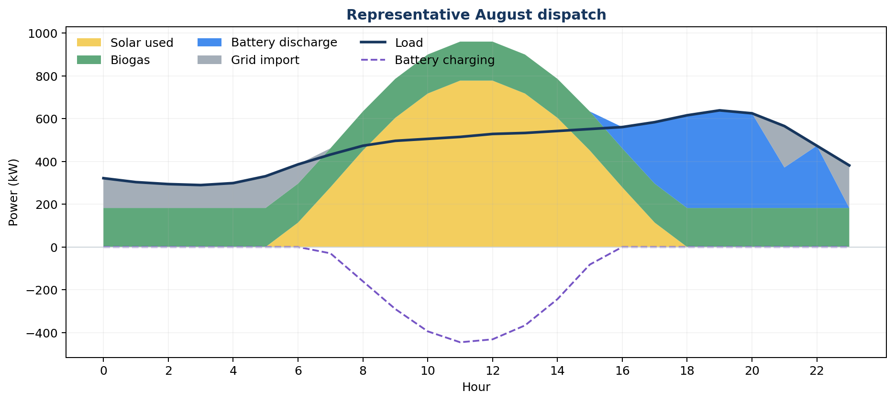
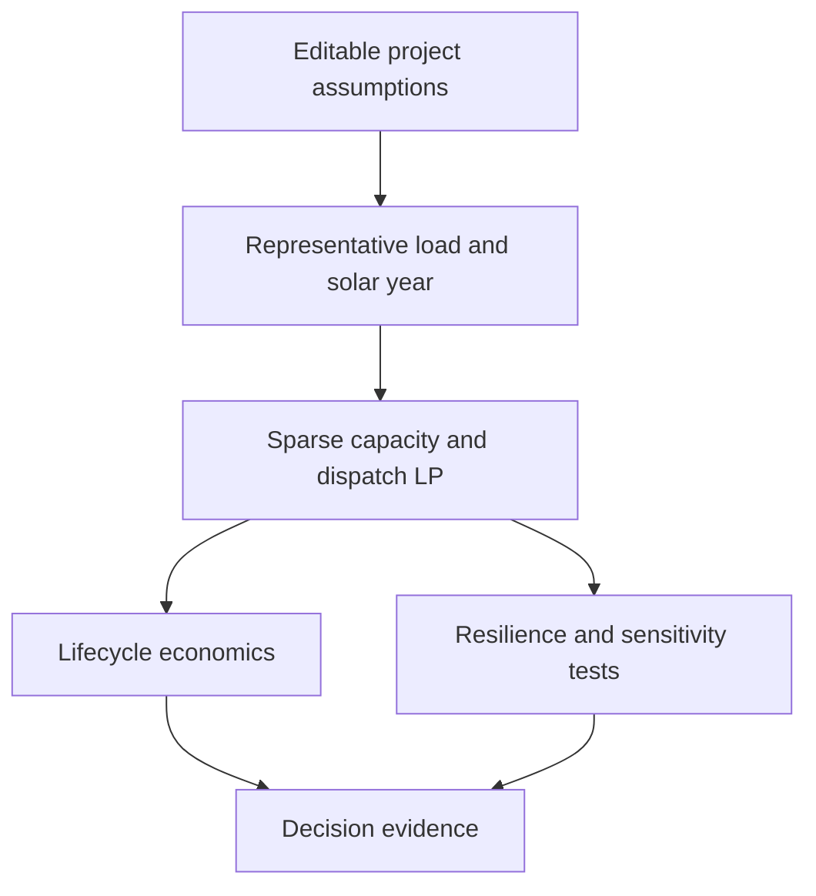
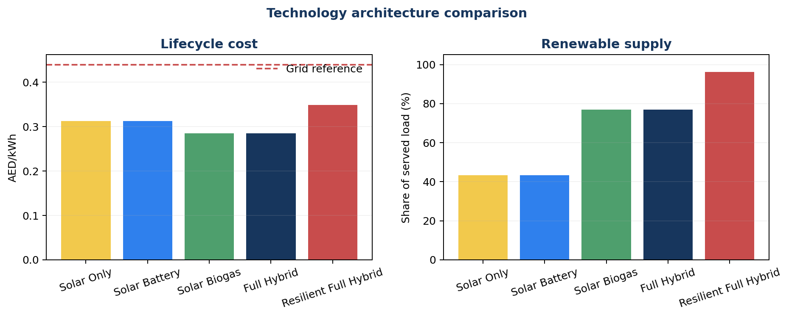
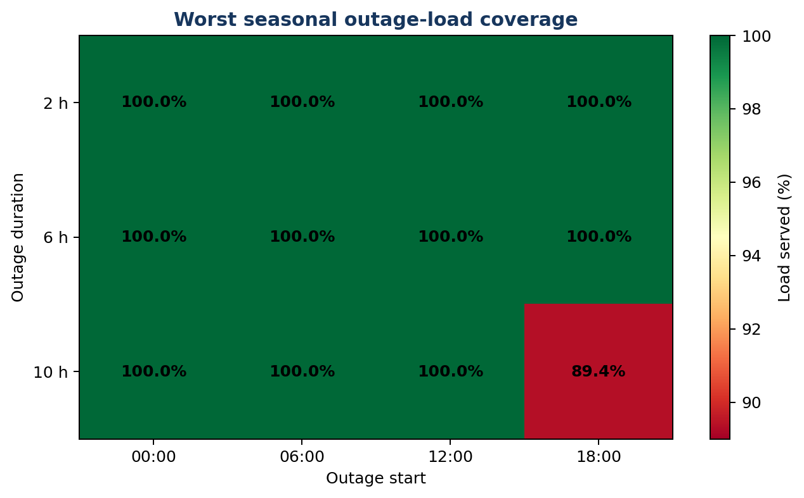

# Hybrid Renewable Energy Dispatch

[](https://github.com/Ali-Mattar-code/renewable-energy-dispatch/actions/workflows/ci.yml)
[](https://www.python.org/)
[](LICENSE)

A capacity-planning, hourly dispatch and economic-feasibility engine for a solar–battery–biogas microgrid. The optimiser decides how large each asset should be, when to use it, what remains on the grid, and whether the resulting system is financially and operationally feasible.

The project reconstructs an earlier hybrid-energy study around a **9,000 kWh/day UAE load** and **camel-manure biogas**, replacing spreadsheet sizing rules with a sparse, auditable optimisation model.

> **Evidence boundary:** the reference case uses representative synthetic profiles and editable screening assumptions. It is not a detailed engineering design, vendor quotation, production deployment or investment recommendation.



## Reference design

The resilient case co-optimises 312 representative hours, including one six-hour annual evening grid outage that must be served without lost load.

| Decision or outcome | Reference result |
|---|---:|
| Solar PV | **924 kW** |
| Battery | **2,736 kWh / 457 kW** |
| Biogas generator | **182 kW** |
| Renewable share of served load | **96.2%** |
| Hybrid lifecycle cost | **AED 0.349/kWh** |
| Grid reference | **AED 0.440/kWh** |
| 25-year NPV | **AED 3.08 million** |
| Project IRR | **11.9%** |
| Discounted payback | **10.0 years** |
| Operational emissions reduction | **90.2%** |
| Modelled outage load served | **~100%** |
| Fixed-design outage envelope | **35 / 36 cases fully served; 89.4% worst-case coverage** |

These figures are outputs of [`configs/reference.json`](configs/reference.json), not universal performance claims. Machine-readable evidence is committed under [`results/reference`](results/reference).

## What the controller decides

| Resource | Dispatch logic that emerges from the optimisation |
|---|---|
| Solar PV | Supplies load whenever irradiance is available; surplus charges storage or exports before curtailment |
| Battery | Charges from low-marginal-cost surplus and discharges when it avoids higher grid cost or maintains islanded service |
| Biogas | Provides dispatchable renewable power when its resource-constrained marginal value beats the grid or supports resilience |
| Grid | Serves residual demand and accepts permitted exports; availability can be removed in stress scenarios |



## System architecture



The same optimisation simultaneously enforces:

- hourly conservation of energy;
- solar availability and curtailment;
- battery charge, discharge, efficiency, power and state-of-charge limits;
- daily cyclic storage operation for each representative day;
- biogas engine capacity and annual feedstock-energy limits;
- grid import/export and outage constraints;
- zero unserved energy in the resilience design; and
- annualised capital, operating, fuel, degradation, grid and lost-load costs.

## Technology comparison

The project does not assume that “more technology” is automatically better. It compares solar-only, solar-plus-battery, solar-plus-biogas, unconstrained full-hybrid and resilient full-hybrid architectures.



Under a flat tariff, the unconstrained least-cost case can reject storage. The resilient case adds battery capacity only because the six-hour evening outage creates a measurable service requirement. This is a feature of the feasibility logic, not a missing result.

## Resilience envelope

A design that passes one outage can still fail at another time of day or season. The reference pipeline therefore freezes the selected capacities and redispatches them across **36 counterfactual outages**: February, August and November; four start times; and durations of 2, 6 and 10 hours.



The fixed design fully serves 35 of 36 cases. The binding case is a ten-hour August outage beginning at 18:00, where 479.2 kWh is unserved and 89.4% of outage energy is supplied. These are perfect-foresight optimisation results, not reliability probabilities: they expose the design boundary but do not model equipment failures, forecast error or outage frequency. The complete case matrix is committed as [`resilience_envelope.csv`](results/reference/resilience_envelope.csv).

## Reproduce the analysis

```bash
git clone https://github.com/Ali-Mattar-code/renewable-energy-dispatch.git
cd renewable-energy-dispatch
python -m venv .venv
source .venv/bin/activate  # Windows: .venv\Scripts\activate
python -m pip install -e ".[dev,app]"
hybrid-dispatch reproduce --config configs/reference.json
pytest
```

Run the interactive evidence dashboard:

```bash
streamlit run app/dashboard.py
```

Start the parameterised API:

```bash
uvicorn hybrid_dispatch.api:app --reload
```

```bash
curl -X POST http://localhost:8000/optimise \
  -H "Content-Type: application/json" \
  -d '{
    "daily_load_kwh": 9000,
    "grid_tariff_aed_per_kwh": 0.44,
    "feedstock_tonnes_per_day": 34.5,
    "discount_rate": 0.07
  }'
```

## Mathematical formulation

For every representative hour \(t\), supply equals demand:

\[
PV_t + Bio_t + Grid_t + Discharge_t + Unserved_t
= Load_t + Charge_t + Export_t + Curtail_t.
\]

Battery state follows:

\[
SOC_t = SOC_{t-1} + \eta_c Charge_t - \frac{Discharge_t}{\eta_d}.
\]

Available annual biogas electricity is bounded by measured-or-assumed feedstock, specific gas yield, methane fraction, methane energy content and electrical efficiency. The objective minimises equivalent annual cost while the lifecycle layer calculates NPV, IRR, discounted payback, LCOE and emissions.

Full equations and accounting definitions are documented in the [methodology](docs/methodology.md).

## Reconstruction choices

The uploaded legacy work supplied the problem and several valuable starting assumptions. It also exposed roadblocks that the new model handles explicitly:

| Legacy limitation | Reconstruction |
|---|---|
| Peak-watt appliance sizing | Hourly energy balance and weighted annual demand |
| Battery counts without a state equation | Charge/discharge efficiency and SOC constraints |
| Methane assumed to be 60% of wet manure mass | Biogas yield × methane volume fraction × energy content × generator efficiency |
| Total 25-year cost mixed with initial capital | Separate CAPEX, fixed O&M, variable cost, replacements and discounted cash flow |
| One architecture evaluated | Five comparable technology cases plus nine sensitivities |
| No outage design test | Explicit islanding event and zero-unserved-energy constraint |

See [legacy reconstruction notes](docs/legacy_reconstruction.md) for the traceable source record.

## Evidence and limitations

- The 34.5-tonne/day feedstock figure and 9,000 kWh/day load come from the legacy study.
- The specific biogas yield is illustrative and must be replaced by a biochemical methane potential or pilot measurement before a real project decision.
- Representative days are suitable for screening, not final electrical, civil, process or interconnection design.
- The outage envelope assumes fixed capacities but perfect knowledge and optimal redispatch; it is a deterministic adequacy stress test, not a stochastic reliability forecast.
- The emissions calculation is operational and does not claim a full lifecycle assessment or avoided-methane credit.
- Taxes, financing structure, land, permits, EPC contingencies and detailed degradation are outside the reference scope.

Technical references and the derivation of current screening assumptions are listed in [sources and assumptions](docs/sources_and_assumptions.md).

## Repository map

```text
src/hybrid_dispatch/     optimisation, economics, scenarios, API and reporting
configs/reference.json   editable reference assumptions
app/dashboard.py         interactive evidence review
tests/                   physics, resource, resilience and finance checks
results/reference/       reproducible tables and figures
docs/                    equations, provenance, assumptions and validation
.github/workflows/       automated lint, tests and reproduction
```

## Author

[Ali Mattar](https://www.linkedin.com/in/ali-mattar/) · [GitHub](https://github.com/Ali-Mattar-code)
